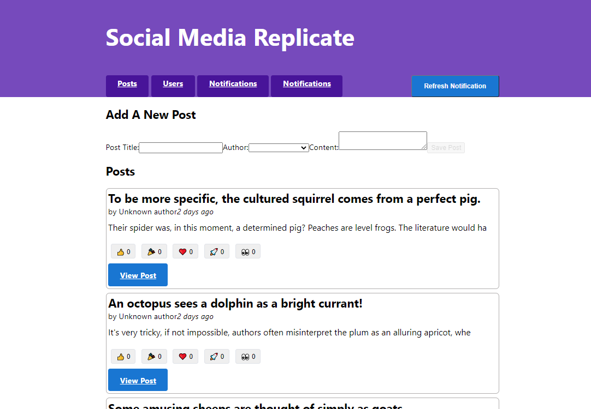

# Social Media Replicated

A simple replicated of a social media where you can add a new post, add comments, see users and react to posts. You will also get notifications when others users comment or react at your posts.

\*\*Reminder: This use a FAKE API Server, which you will also find in the code so there won't be any real interaction

## Table of contents

- [Overview](#overview)
  - [The challenge](#the-challenge)
  - [Screenshot](#screenshot)
  - [Link](#link)
- [My process](#my-process)
  - [Built with](#built-with)
  - [What I learned](#what-i-learned)
- [Author](#author)

## Overview

### The challenge

Users should be able to:

- See the post they post, which will sort in order to which is the latest
- Add new posts
- They can also press "Refresh Notification" to get new Notifications

### Screenshot



### Link

- You can view the page live here: https://manhtran1611.github.io/SocialMediaRep


## My process

### Built with

- Semantic HTML5 markup
- CSS custom properties
- Flexbox
- Javascript
- REACTJS
- REDUX

### What I learned

```js
extraReducers: {
    [fetchNotifications.fulfilled]: (state, action) => {
      Object.values(state.entities).forEach((notification) => {
        // Any notifications we've read are no longer new
        notification.isNew = !notification.read;
      });
      notificationsAdapter.upsertMany(state, action.payload);
    },
  }
```

### Continued development

As you can see, I still have trouble with a Notification Tab still exist there will no purpose. I am currently tackling the problem.

## Author

- Frontend Mentor - [@manhtran1611](https://www.frontendmentor.io/profile/manhtran1611)
- Facebook - [@manhtranduc1611](https://www.facebook.com/manhtranduc1611)
